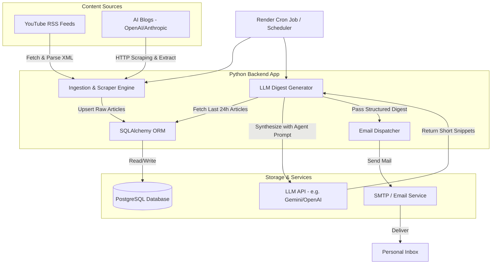

# AI News Aggregator & Daily Digest Agent

A premium, automated pipeline that scrapes news from specified YouTube channels (via RSS) and AI blogs (OpenAI, Anthropic, etc.), stores them in a PostgreSQL database, runs an LLM agent to summarize and synthesize key insights based on a custom system prompt, and emails a structured daily digest to your personal inbox.

---

## 🏗️ System Architecture



---

## 📁 Proposed Project Structure

We will structure the project under an `app` directory for core logic and a `docker` directory for containerized dependencies.

```text
ai-news-aggregator/
├── .gitignore
├── pyproject.toml              # Dependencies (SQLAlchemy, Alembic, httpx, bs4, etc.)
├── README.md                   # Project blueprint (this file)
├── docker/
│   └── docker-compose.yml      # Local PostgreSQL container setup
├── app/
│   ├── __init__.py
│   ├── config.py               # Settings (Pydantic-Settings), loading DB credentials & API keys
│   ├── db/
│   │   ├── __init__.py
│   │   ├── session.py          # SQLAlchemy Engine & SessionMaker setup
│   │   └── models.py           # SQLAlchemy Database Schema Models
│   ├── scraper/
│   │   ├── __init__.py
│   │   ├── base.py             # Abstract base scraper interface
│   │   ├── youtube.py          # YouTube RSS Parser
│   │   ├── blog.py             # Generic / Blog post HTML Scraper
│   │   └── pipeline.py         # Ingestion coordinator (fetches active sources & stores to DB)
│   ├── digest/
│   │   ├── __init__.py
│   │   └── generator.py        # LLM Client integration (Gemini/OpenAI) + Agent System Prompt
│   ├── notifier/
│   │   ├── __init__.py
│   │   └── email_client.py     # SMTP wrapper / Email dispatch logic
│   └── cli.py                  # Command Line Interface (for running jobs & migrations)
```

---

## 🗄️ Database Schema Design

Using **SQLAlchemy** to declare models and construct tables. The schema centers around two primary entities (`sources`, `articles`) and a `digests` tracking table to avoid duplicate summaries.

### 1. `sources` Table
Represents content feeds or websites to monitor.
*   `id`: UUID (Primary Key)
*   `name`: VARCHAR (e.g., "Anthropic Research Blog")
*   `type`: VARCHAR (e.g., `"youtube"`, `"blog"`)
*   `url`: VARCHAR (Main website or channel homepage)
*   `feed_url`: VARCHAR (Optional RSS XML feed URL)
*   `is_active`: BOOLEAN (Default `True`)
*   `created_at`: TIMESTAMP
*   `updated_at`: TIMESTAMP

### 2. `articles` Table
Represents individual blog posts or YouTube videos.
*   `id`: UUID (Primary Key)
*   `source_id`: UUID (Foreign Key linking to `sources.id`)
*   `title`: VARCHAR
*   `url`: VARCHAR (Unique URL to prevent duplicate ingestion)
*   `content`: TEXT (Raw text content or video descriptions)
*   `published_at`: TIMESTAMP
*   `created_at`: TIMESTAMP

### 3. `digests` Table
Tracks sent digests and keeps historical logs of generated digests.
*   `id`: UUID (Primary Key)
*   `raw_content`: TEXT (The markdown-formatted digest generated by LLM)
*   `created_at`: TIMESTAMP (Time of dispatch)

---

## ⚙️ Ingestion & Scraping Logic

1.  **YouTube RSS Ingestion**:
    *   YouTube channels publish standard Atom/RSS feeds at: `https://www.youtube.com/feeds/videos.xml?channel_id=CHANNEL_ID`
    *   We will parse this feed using Python's `xml.etree.ElementTree` or `feedparser` to retrieve titles, publication dates, and video links without requiring the complex YouTube Data API.
2.  **Blog Post Scraping**:
    *   For OpenAI and Anthropic blogs, we will implement web scraping using `httpx` to download HTML and a parser engine (e.g., `BeautifulSoup` or `trafilatura`) to cleanly extract article text body while stripping navigation headers, footers, and scripts.
3.  **Deduplication**:
    *   Use database constraints (unique indexes on `url`) to guarantee we only insert new articles.

---

## 🤖 LLM Daily Digest Agent

*   **Timeframe Filtering**: Select all articles where `published_at` (or `created_at` in db) is within the last 24 hours.
*   **Prompt Architecture**:
    *   **User Insights (System Prompt)**: Define criteria of interest (e.g., *"Focus on announcements regarding new LLM releases, performance benchmarks, costing drops, and agent frameworks. Ignore generic hiring announcements or corporate updates."*)
    *   **Agent Prompt**: Combine all fetched articles (title, source, text snippet/content) and instruct the LLM to write a concise, structured markdown digest containing short, impactful summaries with hyperlinked sources.
*   **LLM Provider**: Configurable (Gemini 1.5 Pro/Flash, OpenAI GPT-4o, or Anthropic Claude 3.5 Sonnet).

---

## 📧 Email Notification Setup

*   Create an HTML/Markdown email dispatcher in `app/notifier/email_client.py`.
*   Uses standard Python `smtplib` and `email.mime` modules.
*   Supports standard configuration via `.env` (SMTP server, port, username, password, recipient address).
*   Can easily connect to services like Resend, Amazon SES, SendGrid, or standard Gmail SMTP.

---

## 🐳 Docker Deployment & Local Setup

### PostgreSQL Database Container
A minimal PostgreSQL Docker setup will live under the `docker/` folder to run locally.

```yaml
# docker/docker-compose.yml
version: '3.8'

services:
  postgres:
    image: postgres:15-alpine
    container_name: ai_news_db
    restart: always
    environment:
      POSTGRES_DB: ai_news
      POSTGRES_USER: postgres
      POSTGRES_PASSWORD: password
    ports:
      - "5432:5432"
    volumes:
      - pgdata:/var/lib/postgresql/data

volumes:
  pgdata:
```

---

## 🚀 Deployment Strategy (Render)

To host and schedule the service every 24 hours on **Render**:
1.  **Render PostgreSQL**: Set up a managed database instance on Render.
2.  **Render Cron Job**:
    *   We will package the backend application as a single Dockerfile or standard Python script.
    *   Deploy a **Render Cron Job** pointing to our repository.
    *   Schedule: `0 8 * * *` (Runs every day at 8:00 AM UTC).
    *   Command: `python -m app.cli run-all` (which executes: Ingestion -> Digest Generation -> Email Notification).

---

## 🛠️ Step-by-Step Implementation Milestones

1.  **Milestone 1: Environment & Database Setup**
    *   Spin up PostgreSQL using the local docker-compose configuration.
    *   Write configurations and define the database models with SQLAlchemy.
    *   Develop a seed script to populate default sources (e.g., target YouTube channels, OpenAI/Anthropic blog URLs).
2.  **Milestone 2: Scrapers & Ingestors**
    *   Implement YouTube RSS feed parser.
    *   Implement OpenAI/Anthropic blog post HTML scrapers.
    *   Build the ingestion pipeline and test database upsert functions.
3.  **Milestone 3: Agentic Digest Engine**
    *   Configure LLM client connector.
    *   Design the agent prompt for synthesizing daily insights.
    *   Generate a sample markdown digest from scraped database articles.
4.  **Milestone 4: Email Dispatcher**
    *   Configure and test SMTP integration to mail the formatted markdown/HTML digest.
5.  **Milestone 5: CLI Orchestrator & Deployment prep**
    *   Create a single CLI entrypoint to run the entire flow sequentially.
    *   Create `Dockerfile` and setup configurations for seamless deployment to Render.
